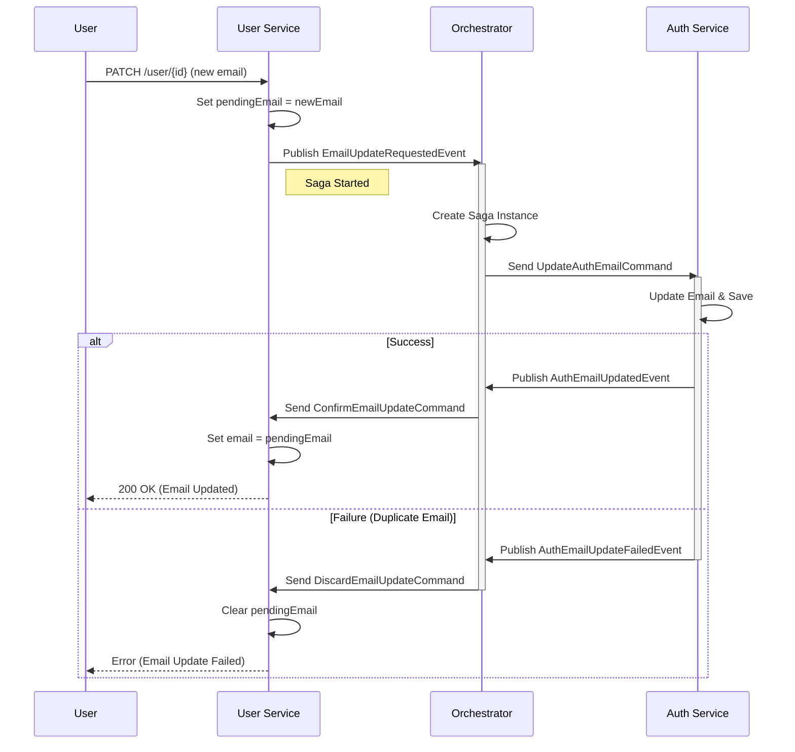
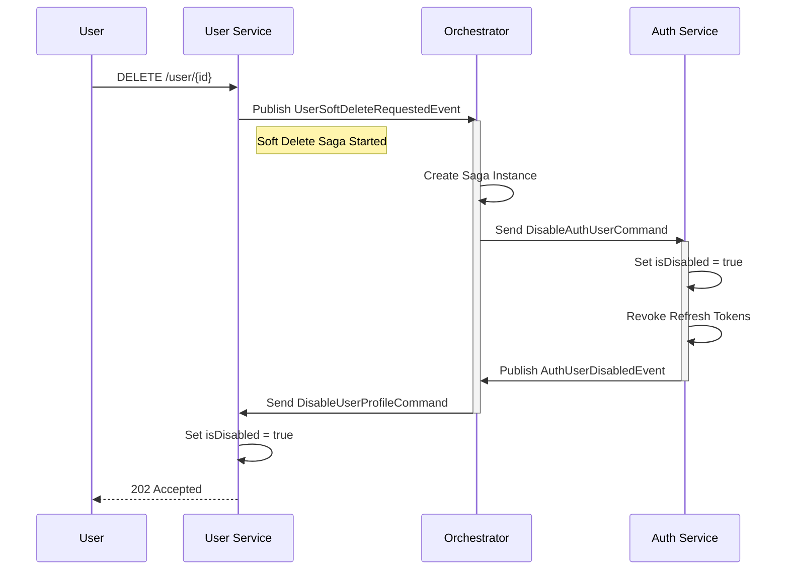

# Practice Microservice Architecture with Spring Boot, Eureka, RabbitMQ, and JWT, Saga Pattern and Orchestration based Saga

This project demonstrates a microservice architecture built with Spring Boot, utilizing an Orchestration-based Saga pattern for distributed transactions and data consistency.

## 🏗️ Architecture Overview

The system consists of several core services:

- **API Gateway**: Entry point for all client requests.
- **Service Registry (Eureka)**: Service discovery and registration.
- **Auth Service**: Handles user authentication, registration, and token management (JWT). Also manages the _User Credential_ store.
- **User Service**: Manages user profiles and personal information.
- **Orchestrator Service**: Coordinates distributed transactions (Sagas) across services to ensure data consistency.
- **Config Server**: Contextual configuration management.

## 🚀 Key Features

- **Microservices**: Decoupled services communicating via REST and RabbitMQ.
- **Resiliency**: Circuit breakers and retry mechanisms (via Resilience4j).
- **Security**: JWT-based authentication and role-based access control.
- **Distributed Transactions (Saga)**:
  - **Orchestration Pattern**: A central orchestrator manages the state of transactions.
  - **Compensation**: Automatic rollback mechanisms if a step in the saga fails.

## 🛠️ Technology Stack

- **Java 17+**
- **Spring Boot 3.x**
- **Spring Cloud** (Gateway, Eureka)
- **Spring AMQP (RabbitMQ)**
- **PostgreSQL**
- **Lombok**
- **MapStruct**

## 🔄 Sequence Diagrams

### 1. Update User Information (Email Update Saga)

When a user updates their email, a saga is triggered to ensure the email is updated in both `Auth Service` (for login) and `User Service` (profile).

### 2. Delete (Disable) User Account (Soft Delete Saga)

Instead of permanently deleting users, we perform a "Soft Delete" by marking the account as disabled. This ensures historical data is preserved while preventing access.

## 📦 Service Setup

### Prerequisites

- Java 17
- Maven 3.8+
- PostgreSQL
- RabbitMQ

### Running the Services

1.  **Service Registry**: Start `eureka-server`.
2.  **Config Server**: Start `config-server` (if applicable).
3.  **RabbitMQ**: Ensure RabbitMQ is running.
4.  **Core Services**: Start `auth-service`, `user-service`, `orchestrator-service`.
5.  **Gateway**: Start `api-gateway`.

### API Endpoints

- **Auth**: `POST /auth/register`, `POST /auth/login`
- **User**: `GET /user/{id}`, `PATCH /user/{id}`, `DELETE /user/{id}`
